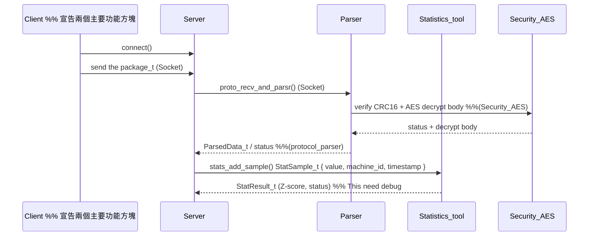

# Industrial_IoT_Sensor_System-simple (Simple Version)

## Introduction
- This project simulates a factory's digital transformation using IoT sensors and a statistical analysis DLL. 
By identifying bottlenecks with low availability or long cycle times, the system applies Industrial Engineering Line Balancing techniques. 
It recommends machine adjustments to optimize utilization rates and balance Takt time effectively.

### The member contribute 
| name           | student_id |                         work content                    | contribute % |           
|----------------|----------  |---------------------------------------------------------|--------------|
| 王界棠          | 114C73032  | Server architecture design , simluation function design |      50      |
| 蕭百淳          | 114C75024  | AES design , The ppt design , code quality check        |      50      |

## 1. Overview
- Purpose: monitor machine vibration, current, and environment, and apply SPC to detect abnormal states.
- Main modules:
    - `Socket/`: Linux -platform socket abstraction
    - `Parser/`: custom protocol
    - `Security_AES/`: AES-128 encryption/decryption for packet body
    - `Statistics_tool/`: online statistics and SPC function: Z-score
    - `Simulation/`: multi-process server + multi-thread client for load test

## 2. The system overview flow chat

## 3. Protocol Design 
- Refer_code : Header_Data_Struct.h: Protocol_Header_t

### 3.1 Header (`Protocol_Header_t`)
| Field          | Type     | Description                         |
|----------------|----------|-------------------------------------|
| `version`      | uint8_t  | Protocol version                    |
| `op_code`      | uint8_t  | Operation (`OpCode_t`)             |
| `sensor_type`  | uint8_t  | Sensor type (`Sensortype_t`)       |
| `aes_iv[16]`   | uint8_t  | AES-128 IV used for body           |
| `body_len`     | uint16_t | Length of encrypted body (bytes)   |
| `seq_no`       | uint16_t | Per-device sequence number         |
| `machine_id`   | uint32_t | Machine identifier                  |
| `timestamp_sec`| uint32_t | Unix time (seconds)                |

### 3.2 Body (`Protocol_Body_t`)
- Refer_code : Body_Data_Struct.h: Protocol_Body_t

- Vibration payload (`Payload_Vibration_t`):
  - Units: velocity in 0.01 mm/s, accel in 0.01 g
- Current payload (`Payload_Current_t`):
  - Units: current in 10 mA, power in 0.1 W, energy in Wh
- Environment payload (`Payload_Env_t`):
  - Units: temperature in 0.01 °C, humidity in 0.01 %RH, light in Lux

### The Security_AES setting

Step 1 : cd/ Security_AES

Step 2 : git clone https://github.com/kokke/tiny-AES-c.git (tiny-AES-c)
        
